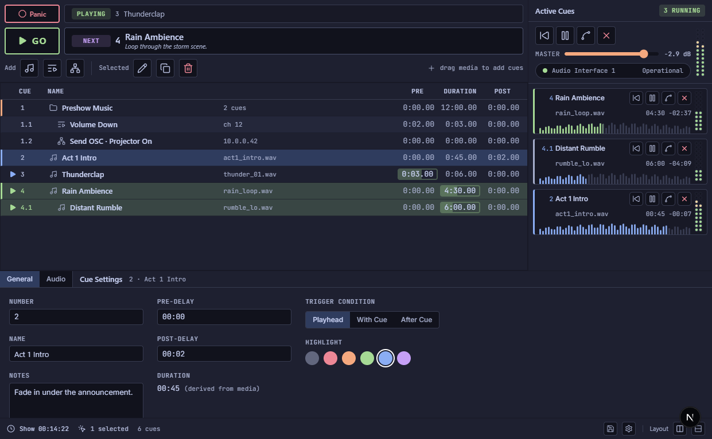

# Articuelate — Theatrical Cue Playback (UI Mockup)

A professional theatrical audio cue playback system mockup inspired by QLab, built as a Next.js 16 + React 19 + Tailwind CSS v4 prototype. This is a **design exploration** — a high-fidelity local mockup intended to validate layout, interaction patterns, and the tokenized design system before translation to a native Rust/Floem implementation.

### Design System

All visual properties (colors, spacing, typography, radii, component dimensions) are defined in `globals.css` via Tailwind v4's `@theme inline` block — zero hardcoded values in TSX. Semantic component classes in `@layer components` provide a 1:1 mapping to Floem's `style_class!()` definitions.

- **Fonts**: Segoe UI (sans), JetBrains Mono (mono)
- **Theme**: Catppuccin Macchiato (dark-only)
- **Icons**: Lucide, routed through a single `AppIcon` registry in `components/icons.tsx`

### Getting Started

```bash
pnpm install
pnpm dev       # starts Next.js on http://localhost:3000
pnpm build     # production build
```